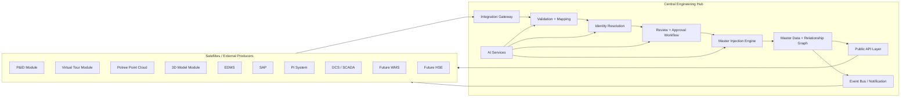

# Integration Schema (Central Engineering Hub)

## 1) Logical architecture

## 2) Canonical module contracts

Each module integrates through one or more contracts:

- `read-api` - query central engineering data.
- `change-package` - submit changes for review/injection.
- `event-subscription` - consume state changes.
- `reference-sync` - consume class dictionaries and code sets.

### 2.1 Module integration matrix

| Module / System | Reads master data | Submits change packages | Subscribes events | Notes |
|---|---:|---:|---:|---|
| P&ID | Yes | Yes | Yes | Sends tag occurrences, notes, references, revisions |
| VT | Yes | Optional | Yes | Consumes links and context overlays |
| Potree | Yes | Optional | Yes | Sends scan metadata and location confidence |
| 3D | Yes | Yes | Yes | Sends object GUID mappings and model revisions |
| EDMS | Yes | Yes | Yes | Sends controlled document metadata and lifecycle state |
| SAP | Yes | Optional | Yes | Consumes approved master updates; work/asset context |
| PI System | Yes | No | Yes | Time-series and AF context; no direct engineering writes |
| DCS/SCADA | Yes | No | Yes | Runtime context and telemetry |
| WMS (future) | Yes | Yes | Yes | Work execution feeds back verified field changes |
| HSE (future) | Yes | Yes | Yes | HSE-critical change approvals and risk metadata |

## 3) Canonical object domains

- `Engineering`: Tag, Equipment, Instrument, Line, System, Location
- `Document`: P&ID, Datasheet, Vendor Doc, Revision
- `Spatial`: 3DObject, PointCloudAsset, VirtualTourAnchor
- `Operational`: WorkOrderRef, AlarmRef, MeasurementRef
- `Governance`: ChangePackage, ReviewTask, ApprovalDecision, AuditEvent

## 4) Data ownership model

- Central hub owns canonical identity and relationship graph.
- Satellites own local representations and authoring context.
- Cross-system references are stored as immutable external keys.

### 4.1 Identity policy

- Global key: `tenant + object_type + canonical_id`
- External mapping table: `source_system + external_key -> canonical_id`
- Manual override required on conflicts above configured threshold.

## 5) Integration modes

### 5.1 Synchronous API mode

Use for low-latency read/query and small writes.

- REST/JSON for broad compatibility.
- Optional GraphQL facade for UI consumers.

### 5.2 Asynchronous package mode

Use for bulk and governed updates.

- Input: file/object payload and metadata.
- Process: validate -> map -> review -> approve -> inject.
- Output: decision reports and event stream.

### 5.3 Event mode

Use for awareness and eventual consistency.

- Topic naming: `ceh.v1.<tenant>.<event_type>`
- Examples: `change_package.approved`, `master.tag.updated`, `impact.high`

## 6) AI in the integration path

- Mapping assistant: external class/attribute to canonical model.
- Duplicate and collision detection for tags and references.
- Relationship inference for line-equipment-instrument chains.
- Change impact narratives for non-technical stakeholders.

## 7) Non-functional constraints

- Tenant isolation by default.
- Audit and lineage on every write and state transition.
- Replayable ingestion pipeline (idempotency key required).
- Contract versioning (`v1`, `v2`) with deprecation policy.

