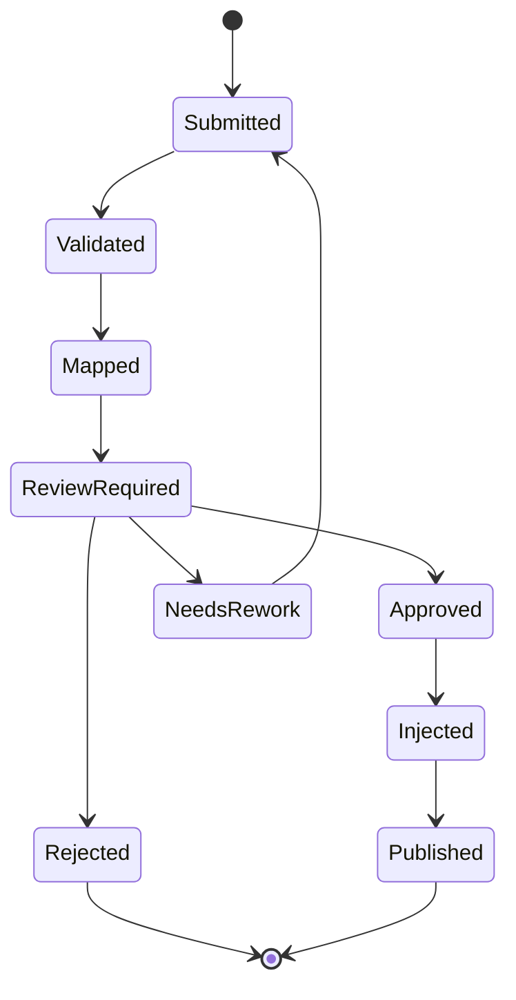

# Master-Satellite Sync and Injection Model

## 1) Concept

- **Master**: Central Engineering Hub (canonical truth).
- **Satellites**: P&ID, 3D, VT, Potree, EDMS, SAP, PI, DCS, contractor tools.
- **Rule**: satellites do not directly mutate master. All writes go through governed injection.

## 2) Synchronization lifecycle

## 3) Change package envelope

Minimum metadata required:

- source organization and source system
- scope (platform/system/discipline)
- package type (new installation, modification, as-built, vendor data)
- effective date and urgency
- risk and HSE impact flags
- artifact links and checksums

## 4) Injection policy

- Block on schema validation failure.
- Block on unresolved identity conflicts.
- Block on missing mandatory approvals.
- Block on safety-critical changes without HSE decision.
- Inject only delta, never full-table overwrite.

## 5) Awareness policy

After `Published`, notify all subscribers:

- engineering teams
- operations teams
- maintenance / WMS
- HSE
- external integrators by subscription

Notification channels:

- webhook events
- message bus topics
- daily digest summaries
- in-app timeline and watchlists

## 6) Conflict handling

Conflict types:

- canonical key collision
- duplicate tag proposal
- relationship contradiction
- stale baseline injection

Resolution workflow:

1. AI proposes possible match or split.
2. Reviewer confirms or edits decision.
3. Decision is stored with reason and evidence.

## 7) Baseline and rollback strategy

- Every package injects against a known baseline snapshot.
- If baseline diverged, package is revalidated.
- Rollback is process-driven by compensating package, not direct delete.

## 8) Future-proofing for WMS and HSE

- WMS consumes approved equipment/line/tag changes and publishes field-verification packages.
- HSE adds mandatory review gates for safety-barrier and permit-impact classes.
- Both modules remain satellites to preserve central governance.

