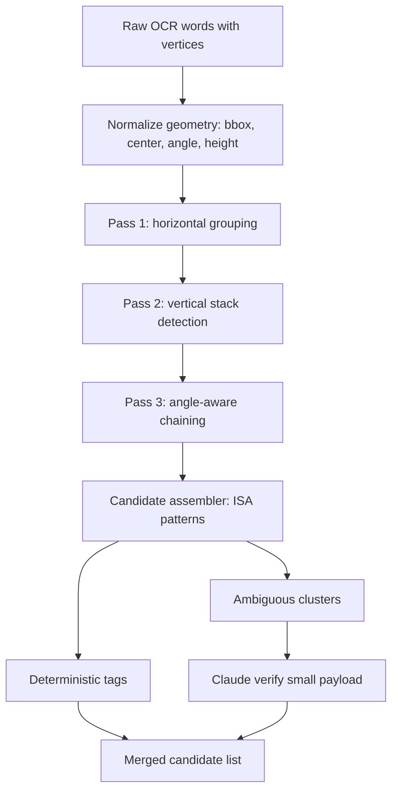

# SESSION: AI Tag Extraction Pipeline Deep Audit and Optimization

Date: 2026-04-06  
Project: AssetView OCR/P&ID Pipeline  
Scope: End-to-end technical audit with optimization design, focused on multi-line ISA bubble tags

Data note: this audit is grounded in repository code and migration state. Raw storage artifacts (`*_raw.json`, `*_classified.json`) and live DB rows were not present in the workspace snapshot, so the report includes implementation-ready instrumentation and validation steps instead of claiming measured runtime metrics.

---

## 1) Executive Findings

The largest accuracy loss is happening before AI reasoning can help:

1. `WordGrouper.js` is strictly horizontal (`areAdjacent`) and never assembles vertically stacked tags inside ISA bubbles.
2. Stage 2 AI classify receives fragmented words (`[index, text, centerX, centerY]`) without vertices/angles, so it cannot reliably recover vertical/rotated structures.
3. No dedicated `continuation_reference` type exists; off-sheet connector data is treated as noise or uncertain text.
4. Noise filtering is mostly prompt-driven post hoc; there is no deterministic zone filter (title block/notes) before expensive AI calls.
5. Review UI supports approve/reject/edit, but there is no automatic "teach the system" path from corrections into reusable patterns/knowledge.
6. Knowledge is partially present (`tag_dictionary`, `tag_analysis`), but not a full platform OCR memory that captures layout/zone/connector conventions.

Impact estimate from current behavior:
- Current noise ~30% is plausible given lack of deterministic pre-filters.
- Multi-line instrument bubbles can explain a large chunk of false negatives because code/number/suffix are split and often individually filtered.
- Existing AI cleanup stages improve classification but cannot fully recover structure already lost in grouping.

---

## 2) Current Pipeline Audit (Where Accuracy Is Lost)

## Stage 1: OCR Extraction

### What works
- `VisionOCRProvider.js` returns word-level vertices and page dimensions.
- Vertices preserve orientation geometry (rotated quads available implicitly via polygon coordinates).
- `ClaudeVisionOCRProvider.js` is available as alternate OCR provider.

### Gaps
- OCR words are stored, but Stage 2 AI prompt uses only centers (`cx`, `cy`), not full geometry.
- Rotation angle is never computed or propagated in the default path.

## Stage 2A: Word Grouping

### What works
- Horizontal glue works for dash-separated left-to-right fragments.

### Critical gap
- `WordGrouper.js` only checks horizontal adjacency with Y overlap and X gap.
- No vertical pass, no cluster detection, no angle-aware grouping, no bubble awareness.
- Hardcoded `maxGapPx=15` is not scale invariant (fails across DPI/export styles).

Result: ISA bubble tags like `ZLO / 289920 / A` remain split into 2-3 items and are often dropped as noise/uncertain.

## Stage 2B: AI Classify

### What works
- Chunking, retry, and token control are solid.
- Word index return enables deterministic bbox recomputation.

### Gap
- Prompt input format strips vertices/angles and sends only centers.
- Model sees broken fragments and cannot robustly infer multiline assembly.

## Stage 3: AI Cleanup

### What works
- Strong prompt scaffolding, revision awareness, draft entity generation.
- Can discover additional tags from fullText in some cases.

### Gap
- Cleanup is still text-centric and cannot reconstruct geometric bubble structure that was never assembled.

## Stage 4/5: Review + Register

### What works
- Human review supports approve/reject/edit.
- Register staging pipeline and traceability are mature.

### Gaps
- Reclassification does not automatically produce reusable pattern updates.
- No one-click "add this correction to platform memory".
- No explicit feedback telemetry (false positive/false negative root cause stats by type/pattern/zone).

---

## 3) Highest Priority: Multi-Line ISA Bubble Assembly

## Problem Statement

Instrument tags inside circles are often vertically stacked:
- Top: function code (`ZLO`, `ZSC`, `PSL`, `TSHH`)
- Middle: loop number (`289920`, `281053`)
- Bottom: suffix (`A`, `B`, `A1`) optional

Current grouper never links vertical stacks, so true tags are lost.

## Option Comparison (A-D)

| Option | Accuracy potential | Cost | Effort | Training data | Risk |
|---|---:|---:|---:|---:|---|
| A. Enhanced WordGrouper (vertical pass) | High immediate gain | Low | Medium | None | Rule tuning complexity |
| B. Claude Vision direct for bubbles | High on complex cases | Medium | Low-Med | None | Per-call cost + bbox stability |
| C. Hybrid clustering + AI verify | Very high | Medium-Low | Med-High | None | More moving parts |
| D. Object detection (YOLO/Detectron) | Highest long-term | Low runtime, high upfront | High | 50-200 annotations | Dataset/ops overhead |

### Recommendation
Adopt **Option C (Hybrid)** now:
1. Keep Google Vision words/vertices as base.
2. Add vertical + angle-aware clustering in backend.
3. Assemble candidate multiline tags with deterministic rules.
4. Send only ambiguous candidates to Claude for verification/correction.

This gives strong accuracy gains with low training burden and controlled API cost.

---

## 4) Proposed Multi-Line Grouping Design (Implementation-Ready)

## 4.1 New grouping flow



## 4.2 Key heuristics

- Compute per-word:
  - `bbox`, `center`, `height`, `width`, `angleDeg` (from vertices 0->1).
- Dynamic thresholds:
  - `gapX = kx * medianWordHeight`
  - `gapY = ky * medianWordHeight`
  - instead of fixed 15 px.
- Vertical stack eligibility:
  - X-center aligned within tolerance.
  - Consecutive rows with small vertical gaps.
  - Typical pattern class on rows: `[A-Z]{2,5}` then `\d{3,7}` then optional `[A-Z]\d?`.
- Assembly output:
  - canonical: `CODE-NUMBER-SFX?`
  - preserve source word indices for bbox merge.

## 4.3 Suggested API surface

- Extend `groupAdjacentWords()`:
  - `groupAdjacentWords(words, options)` with:
    - `enableVerticalPass`
    - `enableAnglePass`
    - `medianScaleFactors`
    - `returnDebugMeta`
- Add `groupMultilineCandidates(words, options)` helper.
- Add `assemblyReason` and `sourcePattern` metadata for explainability.

## 4.4 Pseudocode

```javascript
function assembleIsaStack(cluster) {
  const rows = sortByY(cluster.rows);
  const top = rows[0]?.text || "";
  const mid = rows[1]?.text || "";
  const bot = rows[2]?.text || "";

  if (!/^[A-Z]{2,5}$/.test(top)) return null;
  if (!/^\d{3,7}$/.test(mid)) return null;
  if (bot && !/^[A-Z]\d?$/.test(bot)) return null;

  const tag = bot ? `${top}-${mid}-${bot}` : `${top}-${mid}`;
  return { text: tag, wordIndices: cluster.wordIndices, type: "instrument", source: "isa_vertical_stack" };
}
```

Expected impact:
- Major recovery of ZLO/ZSC/ZSO/ZLC-style missed tags.
- Significant reduction in false negatives before AI cleanup.

---

## 5) Inclined / Rotated Text Handling

## 5.1 Current state
- Rotated geometry is present in Vision vertices but not used.
- Grouping assumes near-horizontal text lines.

## 5.2 Proposed approach

1. Compute orientation:
   - `angleDeg = atan2(v1.y - v0.y, v1.x - v0.x)`.
2. Bucket words by orientation:
   - horizontal (`abs(angle)<15`)
   - diagonal (`15-75`)
   - vertical (`>=75`)
3. Run grouping in local rotated coordinate frame:
   - project points along text direction vector.
4. Merge with same canonical assembler.

This avoids image-level pre-rotation and keeps OCR data untouched.

---

## 6) Drawing Connector / Off-Sheet Continuation Extraction

## 6.1 New entity type

Add `continuation_reference` as extraction-level classification (without breaking existing register schema):

```json
{
  "type": "continuation_reference",
  "targetDrawing": "AD-28-D-100005-SHT-001",
  "connectorId": "1126",
  "lineNumber": "8'-H-28-12-0121-J85S-N",
  "direction": "from"
}
```

## 6.2 Detection strategy (no model training required initially)

- Regex + proximity triads:
  - drawing pattern near `SHT-\d+`
  - standalone numeric connector ID nearby
  - nearby line-number-like string
- Optional lexical cues:
  - `FROM`, `TO`, `CONT`, `CONT'D`, `FLOW LINE`
- Spatial requirement:
  - items in same local neighborhood with connector-like geometry.

## 6.3 Data persistence (additive)

Create table `pnid_continuation_reference` keyed by `pnid_id` + connector identity.
Link to existing `pnid_line` where line match confidence is high.

## 6.4 Cross-P&ID navigation

- Build graph edge: `(pnid,line,connectorId) -> (targetPnid,line,connectorId)`.
- Expose in annotation API for click-through continuation jumps.

---

## 7) Noise Reduction Strategy (Target: <10%)

## 7.1 Pre-AI deterministic filtering

1. Zone filter:
   - learn title block/notes zones per platform/template.
2. Lexical denylist:
   - `REV`, `DATE`, `SCALE`, `ISSUED FOR`, etc.
3. Geometry heuristics:
   - very dense text blocks in title/legend regions are low tag prior.

## 7.2 During AI classify

- Use selective payload:
  - send high-priority candidates + ambiguous clusters, not all obvious noise.
- Keep uncertain bucket wide to reduce false negatives.

## 7.3 Post-AI confidence gating

- Auto-reject high-confidence noise in known noise zones.
- Human review focused on medium-confidence candidates.

---

## 8) User Reclassification and Feedback Loop

Current UI already supports approve/reject/edit decisions. Missing piece is converting those decisions into machine memory.

## 8.1 Proposed review actions

- `Approve as tag` (existing)
- `Reject as noise` (existing)
- `Edit text/type` (existing)
- **New:** `Promote to pattern`
- **New:** `Mark as continuation reference`
- **New:** `Mark as zone noise exemplar`

## 8.2 Feedback persistence (additive tables)

- `ocr_feedback_event`
  - extraction id, action, old/new class, reason, user, timestamp.
- `ocr_learned_pattern`
  - platform id, regex/prefix, class, confidence, source count.
- `ocr_zone_profile`
  - platform id, zone polygons with noise/tag priors.

## 8.3 Auto-learning policy

- Require `N>=3` consistent human corrections before auto-activation.
- Keep suggestions in "draft memory" until approved by reviewer/admin.

---

## 9) Knowledge Preservation Architecture (3-5 P&ID Learning Goal)

## 9.1 Platform OCR Knowledge Base

```json
{
  "platformId": "AKK4",
  "bubbleStyles": [{ "shape": "circle", "rows": ["code","number","suffix"], "confidence": 0.94 }],
  "lineFormats": ["size-service-area-seq-class-insul"],
  "continuationPatterns": [{ "drawingRegex": "AD-\\d{2}-D-\\d+-SHT-\\d+" }],
  "zoneProfiles": [{ "name": "title_block", "x": 0.74, "y": 0.83, "w": 0.26, "h": 0.17, "noisePrior": 0.97 }],
  "customPrefixes": ["ZLO","ZSC","ZSO","ZLC","DGTC"],
  "fewShotExamples": [{ "imageRef": "pnid-001", "approvedTags": ["ZLO-289920-A"] }]
}
```

## 9.2 Prompt integration

Inject compact learned priors into Stage 2 and Cleanup prompts:
- bubble assembly examples
- known prefixes
- known noise zones
- continuation patterns

## 9.3 Drift control

- Keep versioned knowledge snapshots.
- Track accuracy per snapshot and rollback if degradation detected.

---

## 10) Modern AI Alternatives: Accuracy/Cost/Effort

Costs below are directional and should be validated with real token/page telemetry.

| Approach | Accuracy potential | Cost model | Effort | Best use |
|---|---|---|---|---|
| Claude single-pass vision | High for context/multiline | Token-based (`~$3/MTok in`, `$15/MTok out` for Sonnet class) | Low | Fast pilot, hard cases |
| Few-shot Claude (3-5 P&IDs) | High for platform consistency | Similar token model, larger prompt | Medium | Minimum-training objective |
| Google Vision + improved grouping | High with deterministic gains | `Document Text Detection` page pricing (low) | Medium | Cost-efficient default |
| Google Document AI Custom Extractor | Medium-High on templated docs | Higher per-page extraction cost + hosting | Medium-High | Structured region-heavy workflows |
| YOLO/Detectron + OCR hybrid | Very High long-term | Inference cheap after training | High upfront | Production at scale |

Pragmatic recommendation:
- Near-term: Vision + hybrid grouping + selective Claude verify.
- Mid-term: add few-shot memory prompts and zone profiles.
- Long-term: detector for bubbles/connectors if volume justifies annotation effort.

---

## 11) Prompt Engineering Upgrades

## Stage 2 classify prompt improvements

1. Pass richer geometry:
   - include bbox width/height + angle bucket, not just center.
2. Add explicit multiline examples:
   - `["ZLO","289920","A"] -> "ZLO-289920-A"`.
3. Add continuation examples:
   - drawing number + connector id + line number triplet.
4. Enforce strict schema:
   - response JSON schema with `additionalProperties=false`.

## Cleanup prompt upgrades

- Include known noise zones and known platform patterns from memory.
- Add "do not split multiline bubble tags" constraints.
- Separate extraction tasks:
  - `tag_entities`
  - `continuation_references`
  - `noise_annotations`

## Token reduction

- Send compact candidate subsets by zone/type confidence.
- Keep full OCR text optional and capped.
- Cache stable system + dictionary prompt blocks.

---

## 12) End-to-End Automation Feasibility

## Confidence-tiered operations

- `>=0.95`: auto-approve and apply
- `0.70 - 0.95`: human review queue
- `<0.70`: auto-reject/noise or low-priority queue

## Safe zero-review criteria

Require all:
1. Rolling precision >= 98% for 3+ consecutive batches.
2. Critical class recall (instrument/line) >= target threshold.
3. No spike in unknown prefixes or continuation parsing failures.

## Monitoring

- Per-batch:
  - noise ratio
  - multi-line assembly success rate
  - review override rate
  - connector extraction coverage
- Alerts:
  - drift in known patterns
  - sudden confidence collapse
  - OCR provider degradation

---

## 13) Prioritized Delivery Plan

## Phase 1 (1-2 weeks): Immediate accuracy wins

1. Implement vertical + angle-aware grouping in `WordGrouper`.
2. Add multiline ISA assembler with deterministic validation.
3. Add continuation reference extraction via regex+proximity.
4. Add zone-based pre-noise filter config (platform-level).

Expected result: major recovery of missed instrument tags and noticeable noise drop.

## Phase 2 (2-4 weeks): Learning loop

1. Add feedback events from review decisions.
2. Auto-suggest tag dictionary updates from repeated corrections.
3. Store platform OCR knowledge snapshot (zones, patterns, examples).
4. Inject learned priors into Stage 2/Cleanup prompts.

Expected result: reduced manual review per subsequent P&ID.

## Phase 3 (4-8 weeks): Advanced robustness

1. Few-shot inference with 3-5 approved platform exemplars.
2. Evaluate detector-assisted regions for bubbles/connectors.
3. Add continuation graph for cross-P&ID navigation.

Expected result: stable high accuracy on platform-specific conventions.

---

## 14) Concrete Code Change Targets

- `backend/src/services/ocr/WordGrouper.js`
  - Add vertical pass, angle pass, dynamic thresholds.
- `backend/src/services/ocr/OcrPipeline.js`
  - Pass richer geometry metadata to Stage 2 classify.
- `backend/src/services/ocr/AiPromptTemplates.js`
  - Add multiline bubble and continuation examples.
- `backend/src/services/ocr/AiCleanupService.js`
  - Inject platform knowledge priors.
- `backend/src/routes/ocrPipeline.js`
  - Extend review actions for pattern promotion and continuation marking.
- Add new service files:
  - `OcrKnowledgeService.js`
  - `ContinuationReferenceService.js`
  - `OcrFeedbackService.js`

---

## 15) Risk and Mitigation

- Over-grouping false positives:
  - Mitigate with strict row-pattern validation and confidence penalties.
- Increased complexity:
  - Keep deterministic passes modular and toggleable by feature flags.
- Cost creep from AI verification:
  - Only send ambiguous clusters, cache stable prompt context.
- Platform drift:
  - Version and monitor knowledge snapshots with rollback.

---

## 16) Success Metrics

Primary:
- Multi-line bubble recovery rate.
- Instrument recall uplift.
- Noise ratio reduction (target <10%).

Secondary:
- Reviewer decisions per drawing.
- Time-to-review per drawing.
- Auto-approve precision in high-confidence tier.

---

## Final Recommendation

For maximum accuracy with minimum training effort:

1. Keep Google Vision as low-cost base extractor.
2. Add deterministic vertical/angle-aware assembly immediately.
3. Use Claude selectively for ambiguous clusters and few-shot adaptation.
4. Persist platform knowledge (patterns, zones, examples) and continuously learn from review actions.

This path aligns with the target outcome: after reviewing 3-5 P&IDs, the system should materially improve on subsequent drawings with much lower manual workload.

