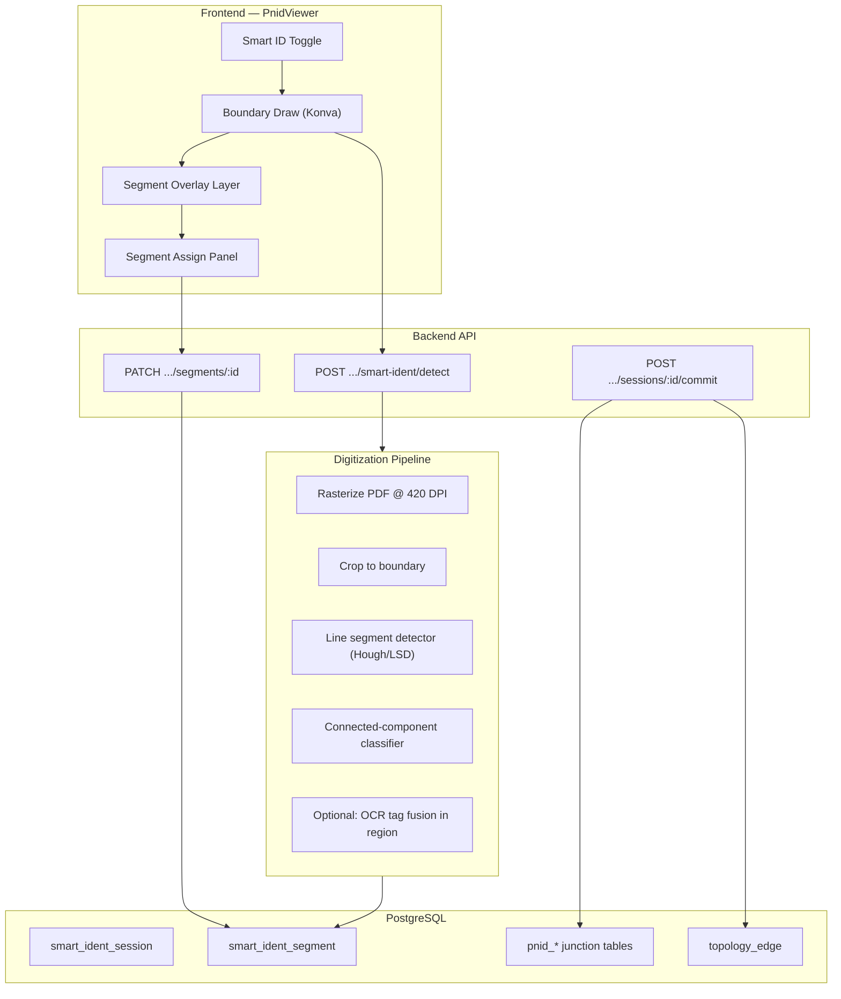

# Smart Identification — Architecture & Implementation Plan

## Problem Statement

Engineers need to **identify and relate equipment, lines, and instruments directly on a P&ID drawing** — not just as bounding-box annotations, but as **digitized geometry** (pipe runs, symbol outlines, instrument bubbles) with explicit **parent–child relationships** (e.g. a line segment belongs to header `2"-PG-101`, which connects to equipment `P-101`).

Current AssetView capabilities (manual Konva annotations, OCR tag extraction, AI few-shot detection) solve **tag placement** but not **pipe-path digitization** or **segment-level relationship modeling**.

---

## User Journey

```
┌─────────────────────────────────────────────────────────────────────────┐
│  1. Open P&ID (Annotation Workspace or inline viewer)                   │
│  2. Toggle "Smart Identification" ON                                  │
│  3. Draw boundary rectangle around area of interest                     │
│  4. System digitizes → lines, circles, shapes as selectable segments    │
│  5. Click segment → assign tag from register + optional parent segment  │
│  6. Assigned segments render in semantic colors; unassigned stay muted    │
│  7. Commit → junction tables + topology edges updated                   │
└─────────────────────────────────────────────────────────────────────────┘
```

---

## Surface: P&ID Drawing Canvas (not System Canvas)

The **P&ID raster canvas** (`PnidViewer`) is the correct surface:

| Reason | Detail |
|--------|--------|
| Raster source | Drawings are PDF/image; digitization operates on pixels |
| Existing stack | Konva overlay, % coordinates, LinkDialog entity lists |
| Junction model | `pnid_line`, `pnid_equipment`, `pnid_instrument` already store placement |
| Downstream | `canvasGenerator.js` consumes annotations → topology graph |

System Canvas remains the **consumer** of committed relationships (topology edges, line tracing).

---

## Architecture Overview



---

## Data Model

### `smart_ident_session`

One boundary selection + detection run per P&ID area.

| Column | Type | Purpose |
|--------|------|---------|
| `id` | UUID | PK |
| `pnid_id` | UUID FK | Drawing |
| `boundary_x/y/w/h_pct` | DECIMAL | User-drawn ROI |
| `page_number` | INT | PDF sheet (default 1) |
| `status` | ENUM | `processing` → `ready` → `committed` |
| `segment_count` | INT | Denormalized count |
| `metadata` | JSONB | Detection params, warnings |

### `smart_ident_segment`

Atomic digitized geometry — the core entity.

| Column | Type | Purpose |
|--------|------|---------|
| `id` | UUID | PK |
| `session_id` | UUID FK | Parent session |
| `pnid_id` | UUID FK | Denormalized for queries |
| `segment_type` | VARCHAR | `line`, `circle`, `arc`, `rect`, `polyline`, `symbol` |
| `geometry` | JSONB | `{ points: [{xPct,yPct}], xPct, yPct, wPct, hPct }` |
| `detection_confidence` | DECIMAL | 0–1 |
| `linked_entity_type` | VARCHAR | `line` \| `equipment` \| `instrument` \| null |
| `linked_entity_id` | UUID | Register entity FK |
| `parent_segment_id` | UUID FK self | **Optional parent–child between segments** |
| `display_color` | VARCHAR(7) | Computed on assign |
| `assigned_at` | TIMESTAMPTZ | |
| `metadata` | JSONB | OCR text hint, merge group, symbol class |

### Relationship Semantics

```
Equipment P-101 (parent segment: circle/rect)
  └── Line 2"-PG-101 (child segment: polyline)     ← pipe connected to equipment
        └── Instrument PT-101 (child segment)       ← instrument on line
```

- **Parent segment** = structural containment (equipment owns line, line owns instrument)
- **Linked entity** = register identity (tag from Miller column lists)
- On **commit**, parent–child segments with linked entities generate:
  - `pnid_*` junction placements (centroid of segment geometry)
  - `topology_edge` rows via extended `canvasGenerator` (Phase 2)

---

## Digitization Pipeline (Phase 1 → Phase 3)

### Phase 1 — Implemented (sharp + classical CV)

1. Rasterize PDF/image (reuse `VisualDetectionUtils.rasterizeForVisualDetection`)
2. Crop boundary region
3. Grayscale → adaptive threshold → binary
4. **Line detection**: horizontal/vertical run scanning + merge collinear segments
5. **Shape detection**: connected components → classify circle vs rect by aspect ratio & fill density
6. Convert pixel coords → **percentage coords** (matches entire AssetView coordinate system)
7. Persist segments; return to UI

### Phase 2 — OCR fusion

- Run OCR on boundary crop (existing Google Vision pipeline)
- Match extracted tags to segments by spatial overlap
- Pre-fill `metadata.suggestedTag` + confidence in assign panel

### Phase 3 — Deep learning

- SAM 2 / YOLO-World for symbol instance segmentation (see `PID_DIGITIZATION_PROPOSAL.md`)
- DeepLSD for sub-pixel pipe tracing
- ISA 5.1 symbol classifier on crops

---

## API Contract

```
GET    /api/v1/pnids/:pnidId/smart-ident/sessions
GET    /api/v1/pnids/:pnidId/smart-ident/sessions/:sessionId
POST   /api/v1/pnids/:pnidId/smart-ident/detect
       Body: { boundary: { xPct, yPct, wPct, hPct }, pageNumber?: 1 }
PATCH  /api/v1/pnids/:pnidId/smart-ident/segments/:segmentId
       Body: { linkedEntityType, linkedEntityId, parentSegmentId?, label? }
POST   /api/v1/pnids/:pnidId/smart-ident/sessions/:sessionId/commit
DELETE /api/v1/pnids/:pnidId/smart-ident/sessions/:sessionId
```

---

## Frontend Components

| Component | Role |
|-----------|------|
| `SmartIdentificationLayer.jsx` | Konva overlay: boundary draw, segment render, click select |
| `SegmentAssignPanel.jsx` | Entity search (reuse LinkDialog data), parent segment picker |
| `useSmartIdentification.js` | React Query hooks |
| Toggle in `PnidViewer.jsx` header | Mode entry point |

### Visual Language

| State | Color | Stroke |
|-------|-------|--------|
| Unassigned | `#94A3B8` | 1.5px dashed |
| Line (assigned) | `#2D33E0` | 2.5px solid |
| Equipment (assigned) | `#3BE494` | 2.5px solid |
| Instrument (assigned) | `#F39C12` | 2.5px solid |
| Selected | `#FFD700` glow | 3px |
| Has parent | inherit + left accent bar | dashed child link to parent centroid |

---

## Integration with Existing Systems

| System | Integration |
|--------|-------------|
| **LinkDialog / linkable-entities** | Same entity lists for assignment |
| **Miller Columns** | Assigned tags appear in line/equipment/instrument columns after commit |
| **Annotation table** | Commit creates shape annotations for backward compatibility |
| **canvasGenerator** | Phase 2: read `smart_ident_segment` parent–child graph |
| **SelectionBus** | Phase 2: `entity:select` when segment assigned |
| **OCR pipeline** | Phase 2: fuse `ocr_extraction.bbox_*_pct` with segments |

---

## Performance & Storage

- Sessions are **scoped to boundary** — not full-page (keeps segment count manageable: 50–500 per ROI)
- Geometry stored as JSONB points array (~200 bytes/segment)
- Index: `(pnid_id, session_id)`, `(parent_segment_id)`, partial on `linked_entity_id IS NOT NULL`
- Detection runs async-ready (`status: processing`) for Phase 2 job queue

---

## Phased Delivery

| Phase | Scope | Status |
|-------|-------|--------|
| **1a** | DB schema, detect API, boundary UI, segment overlay, assign panel | **This branch** |
| **1b** | Commit → junction sync, color persistence | Next |
| **2** | OCR tag fusion, Miller/SelectionBus sync | |
| **3** | SAM/YOLO symbol segmentation, topology auto-inference | |
| **4** | System Canvas overlay of committed P&ID segments | |

---

## Risks & Mitigations

| Risk | Mitigation |
|------|------------|
| Poor line detection on noisy scans | Boundary ROI limits scope; user can re-run; Phase 3 DL |
| PDF codec missing locally | Poppler fallback (same as OCR/AI annotate) |
| Over-segmentation | Merge collinear segments; min length filter |
| Parent–child ambiguity | UI shows parent picker filtered to assigned segments only |

---

## Branch

`annotation-and-parent-child` — Phase 1a implementation.
